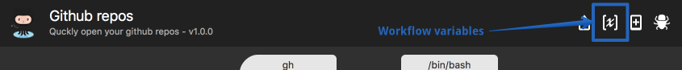

Quickly find your GitHub repositories from [Alfred](http://www.alfredapp.com/).

Download the workflow from the [releases](https://github.com/KnVerey/alfred-github-repos/releases) page.

This is a heavily rewritten fork of `edgarjs/alfred-github-repos` with different search behaviour and several new features. Read more about the changes [below](#whats-new-in-this-fork).

---

[Usage](#usage)

[Configuration](#configuration)

[Update org cache](#update-org-cache)

[Features](#whats-new-in-this-fork)

---

# Usage

Search your public and private repositories (including those of organizations you belong to) by *keyword* and open them on Github.

    gh KEYWORD

# Configuration

**1. Make sure you've got Alfred3 (required)**

This workflow is not compatible with Alfred2. If you aren't able to upgrade, check out the [original workflow](https://github.com/edgarjs/alfred-github-repos) this is based on.

**2. Customize your ruby version (optional)**

This workflow runs a ruby script. By default it will use your system ruby, which may be very old. To use a specific ruby version, update the `rubypath` workflow variable as follows:

**3. Identify yourself (required)**

This workflow requires a github personal access token to be able to list your private and public repositories. This token will be saved in your OSX keychain.

To generate an access token, go to [create a new personal access token](https://github.com/settings/tokens/new). You can enter any description you'd like. Make sure to check both the `repo` and `public_repo` options (read private and public repositories).

Hit "Generate token", and then **copy the token** (as it will be visible only that time!), and authenticate in Alfred:

    gh-auth YOURTOKEN

# Update org cache

To make searches faster, the workflow caches your GitHub username and list of organizations you belong to. If any of this information changes, you'll need to rebuild your local cache with:

    gh-refresh

# What's new in this fork?

### :warning: Requires Alfred3
Uses a JSON script filter and adds these features:
- Hit tab to autocomplete name of selected repo
- Results have "quicklook" enabled: Press SHIFT when on a result to open the quicklook window (only useful if repo is public since you won't be logged in in that window)

### :lock: Security

Uses the OSX keychain to store the Github auth token instead of writing it to a file on disk.

### :round_pushpin: Search behaviour
- Only searches the names of repos that belong to you or your organizations.
- Does a fresh search every time (no repo list cache).
- Returns 10 results max (more isn't useful in Alfred anyway IMO).
- Sorts results by recent activity. For me, this improved relevance, since I'm more likely to be looking for a repo with more recent activity.
- Removed some extra API queries to make it faster.

### :ribbon: Error handling
Implemented some friendly messages for cases not covered upstream.

### :nut_and_bolt: Ruby version

Option to modify the `$PATH` before executing the script to use a more recent ruby version. Set the `rubypath` workflow variable to use this feature (see [Configuration](#configuration) for instructions).

# License

This is released under the [MIT License](http://opensource.org/licenses/MIT).
